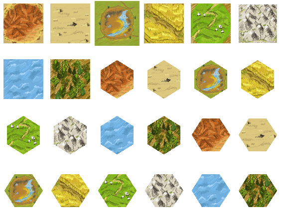

# Pastel Board Game Tiles

Painted in GIMP, exported using scripts, to make art changes quicker to test

Initially this little art pack was started on OpenGameArt at https://opengameart.org/content/pastel-resources-tiles-96x96

Warning: end result depends on the visible layers in the GIMP files.

## How to use this?

Edit the layered images in GIMP. Take care of special features like layer opacity - Imagemagick fails to handle them properly.

Then render hex tiles using a script:

Run

    ./hex.sh

in a command line. On Windows, I use right-click "Git Bash Here". (Screenshot: https://i.imgur.com/eiTZzFC.png )

You might have to run chmod +x hex.sh first.

## Requirements

Imagemagick 7 (on Windows, add it to PATH)
on Windows, also install Cygwin, Git Bash or MSYS2 (I use Git)

## License

Copyright 2019 qubodup

Feel free to use for any purpose under one or multiple of the following licenses:
CC-BY-SA 3.0 <https://creativecommons.org/licenses/by-sa/3.0/> or any later version,
GPL 2.0 <http://www.gnu.org/licenses/old-licenses/gpl-2.0.html> or any later version